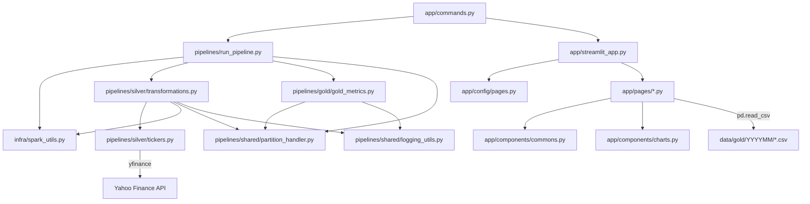

# Investment Visualizer — Guia Completo do Projeto

> Documento de referência para que qualquer IA entenda 100% do projeto sem precisar reler os arquivos-fonte.

---

## 1. Visão Geral

**Investment Visualizer** é um sistema local de acompanhamento de carteira de investimentos pessoais. Ele:

1. Recebe um CSV com posições de investimentos de múltiplas instituições financeiras
2. Processa os dados através de uma pipeline ETL (Bronze → Silver → Gold) usando **PySpark**
3. Exibe dashboards interativos em uma aplicação **Streamlit** com gráficos **Plotly**

### Stack Tecnológica
- **Python 3.11** (restrição `>=3.11,<3.12`)
- **PySpark** (processamento de dados, local[1])
- **Pandas** (cache, conversões intermediárias)
- **yfinance** (cotações da B3 / Yahoo Finance)
- **Streamlit** (UI/dashboard)
- **Plotly** (gráficos)

---

## 2. Estrutura de Diretórios

```
investment-visualizer/
├── app/                          # Aplicação Streamlit
│   ├── streamlit_app.py          # Entry point da UI, roteador de páginas
│   ├── commands.py               # Entry points CLI (iv-run, iv-app)
│   ├── components/
│   │   ├── commons.py            # Componentes compartilhados (filtros, blocos de valor, CSS)
│   │   └── charts.py             # Wrappers Plotly (pie, line, bar charts)
│   ├── config/
│   │   └── pages.py              # Configuração de rotas/páginas (PAGES dict)
│   ├── pages/
│   │   ├── home.py               # Dashboard consolidado
│   │   ├── aportes.py            # Histórico de aportes
│   │   ├── page_1.py             # Página instituição (ex: XP)
│   │   ├── page_2.py             # Página instituição (ex: Nubank)
│   │   ├── page_3.py             # Página instituição (ex: Clear)
│   │   └── page_4.py             # Página instituição (ex: Binance)
│   └── static/                   # Fontes customizadas (SpaceGrotesk, SpaceMono)
├── data/
│   ├── bronze/
│   │   ├── economias.csv         # INPUT: CSV bruto (removido após processamento)
│   │   ├── dummy.csv             # Arquivo de exemplo/template
│   │   └── history/              # Arquivos processados: {YYYYMM}_{filename}
│   ├── silver/
│   │   ├── snapshots/            # Snapshots processados: {YYYYMM}_silver_snapshot.csv
│   │   └── tickers_cache/        # Cache de preços Yahoo Finance
│   │       ├── tickers_cache.parquet
│   │       └── tickers_cache.csv
│   └── gold/
│       └── {YYYYMM}/            # 10 CSVs por mês para consumo da UI
├── pipelines/
│   ├── run_pipeline.py           # Orquestrador principal (Bronze → Silver → Gold)
│   ├── silver/
│   │   ├── transformations.py    # Limpeza, normalização, enriquecimento com preços
│   │   └── tickers.py            # Interface Yahoo Finance + gestão de cache
│   ├── gold/
│   │   └── gold_metrics.py       # Agregações e métricas para a UI
│   └── shared/
│       ├── partition_handler.py  # Escrita/particionamento de arquivos por camada
│       └── logging_utils.py      # Coletor de warnings e formatação de logs
├── infra/
│   └── spark_utils.py            # Sessão PySpark + UDF normalize_ptbr_number
├── .streamlit/
│   └── config.toml               # Tema e configurações visuais do Streamlit
├── pyproject.toml                # Dependências e scripts CLI
├── preenchimento.txt             # Rascunho do formato de input por instituição
└── README.MD                     # Documentação extensa do projeto
```

---

## 3. Comandos CLI

Definidos em `pyproject.toml` → `app/commands.py`:

| Comando   | Função      | O que faz                                     |
|-----------|-------------|-----------------------------------------------|
| `iv-run`  | `iv_run()`  | Executa pipeline ETL completa + abre UI       |
| `iv-app`  | `iv_app()`  | Abre apenas a UI Streamlit (sem pipeline)     |

---

## 4. Pipeline ETL — Fluxo Completo

### 4.1 Ordem de Execução (`run_pipeline.py`)

```
1. configure_pipeline_logging()     → Configura logs + coletor de warnings
2. build_spark()                    → Cria sessão PySpark (local[1], 4GB RAM)
3. run_silver_pipeline()            → Bronze → Silver (limpeza + cotações)
4. run_gold_pipeline()              → Silver → Gold (10 métricas agregadas)
5. handler_partitions(bronze)       → Arquiva CSV original em bronze/history/
6. spark.stop()                     → Encerra sessão
```

### 4.2 Silver Pipeline (`transformations.py`)

```
1. Lê CSV de entrada (Bronze)
2. Corrige cabeçalhos se necessário (Excel → nomes normalizados)
3. _normalize_and_validate_summary_lines():
   - Explode coluna `resumo` (pipe-delimited) em linhas individuais
   - Valida que cada linha tem exatamente 5 campos: tipo|nome|qtd|preco_medio|preco_atual
   - Remove linhas vazias, rejeita linhas malformadas com ValueError
4. Extrai campos do resumo via split por `|`
5. normalize_ptbr_number(): Converte formato BR (1.000,50 → 1000.50)
6. Cria colunas de data: data_apuracao, ano, mes_num, mes
7. Regras de negócio:
   - "fundo imobiliario/imobiliário" → tipo "stock"
   - Tickers em INTERNATIONAL_TICKERS → exposicao "internacional"
   - Cripto → exposicao "internacional"
8. Cast do schema final (double, string, date, etc.)
9. get_tickers_price(): Busca cotações no Yahoo Finance
10. handler_tickers_cache(): Atualiza cache local
11. _enrich_with_ticker_prices(): Merge preços com fallback
12. _validate_silver_output(): Valida que não há nulos críticos
13. handler_partitions(silver): Salva snapshot
```

### 4.3 Gold Pipeline (`gold_metrics.py`)

Gera **10 datasets** para consumo da UI:

| #  | Dataset               | Descrição                                              |
|----|-----------------------|--------------------------------------------------------|
| 1  | `home_linha`          | Evolução valor total por mês (ALL + por instituição)   |
| 2  | `home_botoes`         | Último valor de cada instituição                       |
| 3  | `home_barras`         | Valor total anual com variação %                       |
| 4  | `aportes_linha`       | Aportes mensais (ALL + por instituição)                |
| 5  | `aportes_barras`      | Aportes anuais                                         |
| 6  | `pizza_expo`          | Distribuição por exposição (nacional/internacional)    |
| 7  | `pizza_tipo`          | Distribuição por tipo (stock, cripto, renda fixa)      |
| 8  | `instituicao_linha`   | Evolução por ativo dentro de cada instituição          |
| 9  | `instituicao_label`   | Labels com preço médio, atual, variação % por ativo    |
| 10 | `instituicao_barras`  | Barras anuais por ativo em cada instituição            |

### 4.4 Particionamento (`partition_handler.py`)

- **Bronze**: Move para `data/bronze/history/{YYYYMM}_{filename}`
- **Silver**: Salva em `data/silver/snapshots/{YYYYMM}_silver_snapshot.csv`
- **Gold**: Salva em `data/gold/{YYYYMM}/{YYYYMM}_gold_{nome}_snapshot.csv`
- Partição derivada do `MAX(data_apuracao)` no DataFrame

---

## 5. Sistema de Cotações e Cache

### 5.1 Busca de Preços (`tickers.py` → `get_tickers_price()`)

1. Filtra tickers de `tipo == "stock"` com `preco_atual` nulo
2. Converte ticker para formato Yahoo: `BOVA11` → `BOVA11.SA`
3. Chama `yf.download()` com lookback de 7 dias
4. Para cada ticker, seleciona o `close` mais recente com `close > 0`
5. Retorna DataFrame Spark com: `data_preco`, `ticker`, `close`, `extracted_at`, `data_apuracao`
6. `data_apuracao` = `CAST(extracted_at AS date)` → data da execução do pipeline

### 5.2 Cache (`tickers.py` → `handler_tickers_cache()`)

- **Localização**: `data/silver/tickers_cache/` (Parquet + CSV)
- **Merge**: Concatena dados novos com cache existente
- **Dedup**: Ordena por `[ticker, data_preco, extracted_at DESC]`, mantém primeiro (mais recente)
- **Escrita Segura**: Escreve em `_temp/` → deleta original → renomeia temp
- **Retorna**: DataFrame Spark com todo o cache atualizado

### 5.3 Enriquecimento com Fallback (`transformations.py` → `_enrich_with_ticker_prices()`)

```
1º Tentativa: JOIN exato → df.nome == cache.ticker AND df.data_apuracao == cache.data_apuracao
2º Tentativa (Fallback): Se ainda há stocks com preco_atual nulo:
   - Busca MAX(data_apuracao) no cache inteiro
   - Faz JOIN apenas por ticker com registros dessa data mais recente
   - Aplica F.coalesce(preco_atual, _fallback_close)
3º: Calcula valor_total = preco_atual * qtd
```

### 5.4 Validação Final (`_validate_silver_output()`)

- Conta linhas com `preco_atual IS NULL` ou `valor_total IS NULL`
- Se houver qualquer nulo: **lança ValueError e aborta a pipeline**
- Isso IMPEDE que dados incompletos cheguem ao Gold

---

## 6. Formato de Input (Bronze)

### CSV esperado: `data/bronze/economias.csv`

| Coluna             | Formato                                  |
|--------------------|------------------------------------------|
| `timestamp`        | `dd/MM/yyyy HH:mm:ss`                   |
| `data_apuracao`    | `dd/MM/yyyy`                             |
| `instituicao_fin`  | Nome da corretora (XP, Clear, Nubank...) |
| `resumo`           | Multiline, pipe-delimited (ver abaixo)   |
| `aporte`           | Valor do aporte (formato BR)             |

### Formato do campo `resumo`:

```
tipo | nome | qtd | preco_medio | preco_atual
```

- Cada ativo em uma **linha separada** dentro da mesma célula CSV
- Para ações (`stock`): `preco_atual` pode ser vazio → será buscado no Yahoo Finance
- Para renda fixa/cripto: `preco_atual` deve ser preenchido manualmente

### Exemplo:

```
stock | BOVA11 | 57 | 175,22 |
stock | IVVB11 | 11 | 376,85 |
renda fixa | CDB Digimais Jul/2029 | 1 | 11000,00 | 11937,83
```

---

## 7. Aplicação Streamlit (UI)

### 7.1 Arquitetura

- **Entry point**: `app/streamlit_app.py`
- **Seletor global**: Dropdown "Mês de referência" no topo (lista partições YYYYMM do Gold)
- **Estado**: `st.session_state["selected_yyyymm"]` controla qual mês está selecionado
- **Leitura de dados**: Cada página faz `pd.read_csv("data/gold/{YYYYMM}/{arquivo}.csv")`

### 7.2 Páginas

| Página    | Arquivo       | Escopo              | Datasets Gold Usados                                          |
|-----------|---------------|---------------------|----------------------------------------------------------------|
| Home      | `home.py`     | Consolidado (ALL)   | home_botoes, pizza_tipo, pizza_expo, home_linha, home_barras   |
| Aportes   | `aportes.py`  | Aportes (ALL)       | aportes_linha, aportes_barras                                  |
| Page 1-4  | `page_N.py`   | Por instituição     | instituicao_label, pizza_tipo, pizza_expo, instituicao_linha, instituicao_barras |

### 7.3 Componentes

- **`commons.py`**: Blocos de valor (HTML), filtro temporal (YTD/6/12/24 meses), formatação de tabelas
- **`charts.py`**: Pie chart, Line chart (abs/%), Grouped bar chart — todos com validação de colunas

### 7.4 Configuração Visual (`.streamlit/config.toml`)

- Tema com cores quentes: primary `#cb785c`, background `#fdfdf8`
- Fontes customizadas: SpaceGrotesk (headings) e SpaceMono (code)
- Border radius suavizado

---

## 8. Tickers Internacionais

Definidos em `transformations.py` → `INTERNATIONAL_TICKERS`:

```python
INTERNATIONAL_TICKERS = [
    "BERK34", "IVVB11", "AAPL34", "MSFT34", "NVDC34",
    "GOGL34", "AMZO34", "TSLA34", "META34", "MELI34",
]
```

Estes recebem `exposicao = "internacional"`. Todos os demais stocks recebem `"nacional"`.
Cripto sempre recebe `"internacional"`.

---

## 9. Pontos Críticos / Armadilhas Conhecidas

### 9.1 Bug do Fallback de Preços com Cache Nulo

O fallback em `_enrich_with_ticker_prices()` tem uma vulnerabilidade:
- O Yahoo Finance pode retornar dados para um ticker mas com `close = NaN/null`
- Esses valores nulos são salvos no cache
- O filtro `WHERE close IS NOT NULL AND close > 0` na query SQL de `build_latest_prices_spark_df()` remove esses registros, resultando em nenhum preço válido para o ticker
- O cache recebe entradas com `close` vazio (ex: `2026-08-04,BOVA11,,extracted_at,data_apuracao`)
- O fallback busca o `MAX(data_apuracao)` no cache, mas o join com o cache nessa data retorna `close` nulo novamente
- **Resultado**: preço fica permanentemente nulo → `_validate_silver_output()` lança ValueError

### 9.2 data_apuracao no Cache vs no Input

- No cache, `data_apuracao = CAST(extracted_at AS date)` (data de quando o pipeline rodou)
- No input, `data_apuracao` é a data preenchida pelo usuário no formulário
- Se essas datas forem diferentes, o JOIN exato da 1ª tentativa falha
- O fallback recupera buscando pelo `MAX(data_apuracao)` do cache inteiro

### 9.3 Validação que Aborta

- `_validate_silver_output()` lança `ValueError` se houver nulos em `preco_atual` ou `valor_total`
- Se a pipeline completou com nulos, significa que a validação foi adicionada DEPOIS da execução, ou foi temporariamente desabilitada

---

## 10. Fluxo de Dados Resumido

```
economias.csv (Bronze input)
    ↓
[run_silver_pipeline]
    ├── Lê CSV → valida → normaliza → aplica regras de negócio
    ├── Busca cotações Yahoo Finance (7 dias lookback)
    ├── Atualiza cache (Parquet + CSV em tickers_cache/)
    ├── Enriquece com preços (JOIN exato → fallback por data mais recente)
    ├── Valida output (zero nulos permitidos)
    └── Salva → data/silver/snapshots/{YYYYMM}_silver_snapshot.csv
         ↓
[run_gold_pipeline]
    ├── Lê Silver snapshot
    ├── Gera 10 DataFrames agregados
    └── Salva → data/gold/{YYYYMM}/ (10 CSVs)
         ↓
[Streamlit UI]
    └── Lê CSVs do Gold → exibe dashboards
         ↓
economias.csv → data/bronze/history/{YYYYMM}_economias.csv
```

---

## 11. Dependências entre Arquivos


