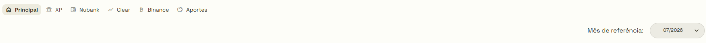
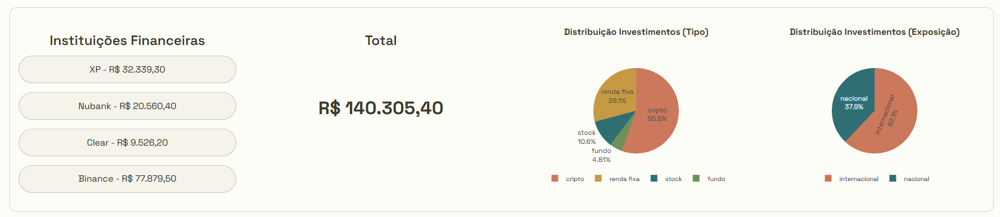
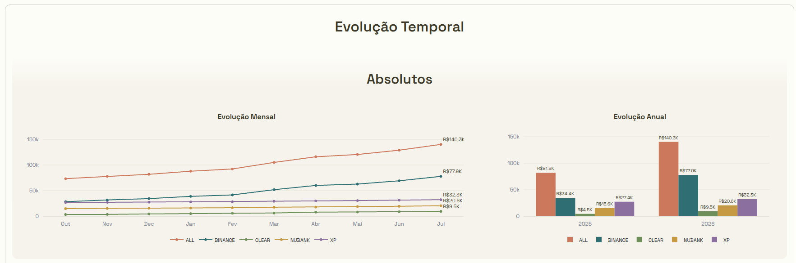
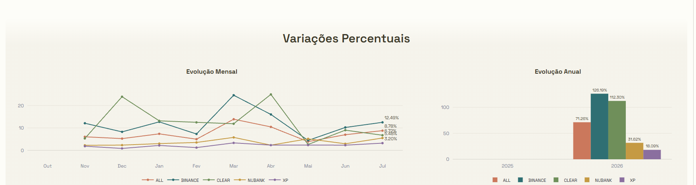
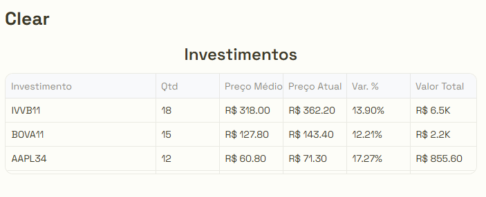
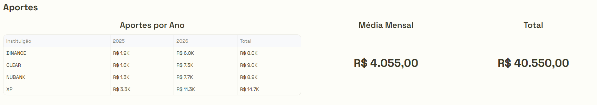

# Investment Visualizer 📊

O **Investment Visualizer** é um projeto local para acompanhar uma carteira de investimentos a partir de um CSV simples. A ideia é pegar um arquivo bruto, organizar os dados em camadas, gerar métricas prontas para visualização e abrir um dashboard em Streamlit para navegar por mês, instituição, tipo de ativo e exposição.

Ele não tenta ser uma plataforma financeira completa. O foco é mais direto: transformar registros pessoais em uma visão clara de patrimônio, evolução e distribuição dos investimentos.

> As imagens e valores abaixo foram gerados com dados **dummy**, apenas para demonstrar a visualização da aplicação. Eles não representam uma carteira real.

## Visual da Aplicação ✨

### Navegação e mês de referência 🧭

A parte superior concentra a navegação principal do app e o seletor de mês. Esse seletor permite fazer um "time travel" pelos snapshots já gerados: ao trocar o mês de referência, a Home, as páginas de instituição e a página de aportes passam a ler os arquivos Gold daquela competência.



### Resumo da carteira 💰

A primeira área da Home mostra o total consolidado do mês, os atalhos para cada instituição e as distribuições principais da carteira. Os botões de instituição levam direto para a página filtrada daquela instituição, mantendo o mês selecionado.



### Evolução temporal em valores absolutos 📈

Essa seção mostra a evolução do patrimônio ao longo do tempo. O gráfico mensal acompanha a linha de cada instituição e o consolidado geral. O gráfico anual resume o último snapshot disponível de cada ano, evitando que um mesmo ano apareça com múltiplos registros.



### Evolução temporal em percentuais 📊

A leitura percentual ajuda a comparar crescimento relativo entre instituições, mesmo quando os valores absolutos são bem diferentes. A visão mensal mostra a variação mês a mês; a anual consolida a variação por ano.



### Página de instituição 🏦

As páginas de instituição seguem a mesma lógica visual da Home, mas com escopo filtrado. A diferença é que elas exibem a tabela de investimentos daquela instituição, o total específico e as distribuições apenas dos ativos daquele recorte.



### Página de aportes 💸

A página de aportes acompanha o dinheiro novo colocado na carteira, consolidado por instituição financeira. A primeira área traz a matriz anual de aportes, com cada instituição nas linhas, anos e total nas colunas, além da média mensal e do total aportado. A leitura é propositalmente mais agregada que a carteira de investimentos: o aporte nasce no nível da instituição, não no nível de cada ativo.



## O Que Dá Para Ver No App 🔎

| Área | O que mostra |
| --- | --- |
| 🏦 Instituições | Botões com o total por instituição financeira. |
| 💰 Total | Valor consolidado da carteira no mês selecionado. |
| 🥧 Distribuição | Gráficos por tipo de investimento e exposição nacional/internacional. |
| 📈 Evolução mensal | Crescimento do patrimônio mês a mês. |
| 📊 Evolução anual | Comparação por ano, já consolidada para evitar múltiplas barras no mesmo ano. |
| 🔎 Páginas por instituição | Visão filtrada para XP, Nubank, Clear, Binance e outras instituições configuradas. |
| 💸 Aportes | Matriz anual por instituição, média mensal, total aportado e gráficos de evolução dos aportes. |

## Como A Informação Passa Pelo Projeto 🔄

O fluxo é pensado para ser fácil de reprocessar: atualiza o CSV, roda a pipeline e abre o painel.

| Camada | Entrada | Saída | Papel |
| --- | --- | --- | --- |
| Bronze | `data/bronze/economias.csv` | dado bruto | Guarda o arquivo original, do jeito que foi preenchido. |
| Silver | Bronze | `data/silver/snapshots/YYYYMM_silver_snapshot.csv` | Limpa, explode o resumo, tipa colunas, calcula valores e enriquece preços. |
| Gold | Silver | `data/gold/YYYYMM/*_gold_*_snapshot.csv` | Gera tabelas já prontas para os gráficos e cards do Streamlit. |
| App | Gold | Dashboard | Lê os CSVs finais e renderiza a interface. |

## Estrutura Do Projeto 🗂️

```text
investment-visualizer/
  app/
    components/
    config/
    pages/
    static/

  data/
    bronze/
    silver/
      snapshots/
      tickers_cache/
    gold/
      YYYYMM/

  docs/
    images/

  infra/

  pipelines/
    shared/
    silver/
    gold/

  notebooks/
```

## Inicialização ⚙️

### Requisitos 🧰

| Ferramenta | Por quê |
| --- | --- |
| Windows + PowerShell | Ambiente usado no desenvolvimento local. |
| Python 3.11 | O projeto declara suporte para `>=3.11,<3.12`. |
| Java | Necessário para rodar PySpark localmente. |

### Criar ambiente e instalar o projeto 🛠️

```powershell
py -3.11 -m venv .venv
.\.venv\Scripts\Activate.ps1
python -m pip install --upgrade pip setuptools wheel
python -m pip install -e .
```

### Comandos disponíveis ▶️

| Comando | O que faz |
| --- | --- |
| `iv-app` | Abre apenas o dashboard Streamlit. |
| `iv-run` | Roda a pipeline completa e depois abre o dashboard. |
| `python -m pipelines.run_pipeline` | Roda só a pipeline, sem abrir o Streamlit. |

Para testar com a massa fictícia:

```powershell
python -c "from pipelines.run_pipeline import run_pipeline; run_pipeline('data/bronze/dummy.csv')"
```

Depois, abra o app:

```powershell
iv-app
```

## Camada Bronze 🥉

O arquivo principal de entrada fica em `data/bronze/economias.csv`.

Para ações/tickers, o Bronze deve trazer apenas o preço médio. O preço atual fica vazio no CSV e é preenchido automaticamente pela Silver: a aplicação consulta o preço de fechamento, salva o resultado em cache e usa esse valor para calcular o snapshot. Em outros tipos de investimento, como renda fixa ou fundos sem busca automática, o preço atual pode vir preenchido no próprio `resumo`.

Colunas esperadas:

| Coluna | Exemplo | Descrição |
| --- | --- | --- |
| `timestamp` | `05/05/2026 09:00:00` | Momento em que o registro foi criado/coletado. |
| `data_apuracao` | `31/05/2026` | Mês de referência da posição. |
| `instituicao_fin` | `XP` | Instituição financeira da posição. |
| `resumo` | `Stock \| BERK34 \| 10 \| 125,00 \|` | Campo multilinha com os investimentos daquela instituição. |
| `aporte` | `2500` | Valor aportado no registro. |

Cada linha dentro de `resumo` segue este formato:

| Posição | Campo | Exemplo |
| --- | --- | --- |
| 1 | tipo | `Stock` |
| 2 | nome | `BERK34` |
| 3 | quantidade | `10` |
| 4 | preço médio | `125,00` |
| 5 | preço atual | vazio para ações/tickers; preenchido quando o ativo não passa pela busca automática |

Exemplo de uma linha bronze:

```csv
timestamp,data_apuracao,instituicao_fin,resumo,aporte
05/05/2026 09:00:00,31/05/2026,XP,"Stock | BERK34 | 10 | 125,00 |
Renda Fixa | Tesouro Selic 2029 | 1 | 24500,00 | 26380,00",2500
```

No exemplo acima, `BERK34` não informa preço atual. A pipeline busca esse preço depois e mantém o resultado em `data/silver/tickers_cache`. Já a renda fixa informa o preço atual diretamente no CSV.

## Camada Silver 🥈

A Silver é a primeira transformação de fato. Ela pega o CSV Bronze, quebra o campo `resumo` em linhas individuais de investimento e transforma esse dado em uma base limpa, tipada e pronta para agregação.

Entrada principal:

```text
data/bronze/economias.csv
```

Saída principal:

```text
data/silver/snapshots/YYYYMM_silver_snapshot.csv
```

| Etapa | O que acontece |
| --- | --- |
| Leitura do Bronze | Carrega o CSV com suporte a campo multilinha. |
| Explosão do `resumo` | Cada investimento dentro do `resumo` vira uma linha própria. |
| Separação dos campos | Cria `tipo`, `nome`, `qtd`, `preco_medio` e `preco_atual`. |
| Normalização | Ajusta números em formato pt-BR, textos, datas e nomes. |
| Datas auxiliares | Cria `ano`, `mes_num` e `mes` a partir de `data_apuracao`. |
| Exposição | Classifica ativos como `nacional` ou `internacional`. |
| Preços de tickers | Busca preço atual quando ele vem vazio para ações/tickers. |
| Cache | Salva preços consultados em `data/silver/tickers_cache`. |
| Valor total | Calcula `valor_total` com `qtd * preco_atual`. |
| Snapshot | Salva o arquivo final da camada Silver e retorna o caminho para a Gold. |

Na prática, essa camada é responsável por transformar um preenchimento mais manual em uma base consistente. Ela ainda mantém o nível de detalhe por ativo, instituição e mês.

## Camada Gold 🥇

A Gold lê o snapshot Silver e gera os arquivos finais que o Streamlit consome. Essa camada não está preocupada em limpar dado bruto; o papel dela é montar as visões que a interface precisa.

Entrada principal:

```text
data/silver/snapshots/YYYYMM_silver_snapshot.csv
```

Saídas principais:

```text
data/gold/YYYYMM/YYYYMM_gold_<nome_tabela>_snapshot.csv
```

| Saída Gold | Uso no app |
| --- | --- |
| `home_linha` | Evolução mensal consolidada da carteira e por instituição. |
| `home_botoes` | Totais mais recentes usados nos botões da Home. |
| `home_barras` | Evolução anual consolidada, usando um snapshot por ano. |
| `pizza_tipo` | Distribuição por tipo de investimento. |
| `pizza_expo` | Distribuição por exposição nacional/internacional. |
| `instituicao_linha` | Evolução mensal por instituição e por ativo. |
| `instituicao_label` | Tabela detalhada de posições da página de instituição. |
| `instituicao_barras` | Evolução anual por instituição e ativo, usando um snapshot por ano. |
| `aportes_linha` | Evolução mensal dos aportes por instituição e consolidado geral. |
| `aportes_barras` | Evolução anual dos aportes por instituição e consolidado geral. |

Além de agregar os valores, a Gold calcula variações percentuais usando o valor anterior dentro de cada grupo. Isso é usado nos gráficos de evolução mensal, evolução anual e nas tabelas de posição.

## O Que Cada Parte Faz 🧩

### `pipelines/run_pipeline.py`

É o orquestrador da pipeline.

Ele cria a sessão Spark, roda a Silver, recebe o caminho do snapshot Silver gerado e passa esse caminho para a Gold. No final, encerra a sessão Spark.

### `pipelines/silver/transformations.py`

Implementa o fluxo da camada Silver descrito acima.

### `pipelines/silver/tickers.py`

Cuida da busca e cache de preços usados pela Silver.

### `pipelines/gold/gold_metrics.py`

Implementa o fluxo da camada Gold descrito acima.

### `pipelines/shared/partition_handler.py`

Centraliza a escrita particionada.

Ele identifica o mês da maior `data_apuracao`, monta o destino correto e salva o arquivo final em `data/silver` ou `data/gold`. Isso evita cada camada inventar uma forma diferente de gravar snapshots.

### `infra/spark_utils.py`

Concentra as configurações locais do Spark.

Também tem helper para converter números em formato brasileiro, como `1.234,56`, para valor numérico.

## App Streamlit 🖥️

### `app/streamlit_app.py`

É a entrada do dashboard.

Ele lista os meses disponíveis em `data/gold`, mantém o mês selecionado em `st.session_state`, monta a navegação e chama a página correta.

### `app/pages`

| Arquivo | Responsabilidade |
| --- | --- |
| `home.py` | Visão consolidada da carteira. |
| `page_1.py` a `page_4.py` | Páginas filtradas por instituição. |
| `aportes.py` | Visão consolidada dos aportes por instituição. |

### `app/components`

| Arquivo | Responsabilidade |
| --- | --- |
| `charts.py` | Funções reutilizáveis para gráficos Plotly. |
| `commons.py` | Layout compartilhado, botões, totais, navegação e estilos. |

### `app/config/pages.py`

Define as páginas disponíveis, os títulos e o escopo usado para filtrar cada instituição.

### `app/commands.py`

Implementa os comandos expostos pelo `pyproject.toml`:

| Função | Comando | Responsabilidade |
| --- | --- | --- |
| `iv_app` | `iv-app` | Abre o Streamlit. |
| `iv_run` | `iv-run` | Roda a pipeline e depois abre o Streamlit. |

## Esquemas Das Saídas Principais 📦

Aqui faz sentido falar em esquema porque os arquivos já chegam com colunas mais estáveis e tipadas para consumo da aplicação.

### Silver 🥈

| Coluna | Tipo esperado | Observação |
| --- | --- | --- |
| `timestamp` | timestamp | Data/hora original do registro. |
| `data_apuracao` | date | Data de referência da posição. |
| `ano` | int | Ano da apuração. |
| `mes_num` | int | Mês numérico. |
| `mes` | string | Nome abreviado do mês. |
| `instituicao_fin` | string | Instituição normalizada. |
| `tipo` | string | Tipo normalizado do investimento. |
| `nome` | string | Nome/ticker do ativo. |
| `qtd` | double | Quantidade. |
| `preco_medio` | double | Preço médio. |
| `preco_atual` | double | Preço usado no snapshot. |
| `valor_total` | double | `qtd * preco_atual`. |
| `aporte` | double | Aporte informado no Bronze. |
| `exposicao` | string | `nacional` ou `internacional`. |

### Gold 🥇

As tabelas Gold variam conforme o gráfico, mas seguem uma lógica comum:

| Família | Colunas comuns | Para que serve |
| --- | --- | --- |
| Linha | `data_apuracao`, `ano`, `mes`, `valor_total`, `variacao_percentual` | Evolução temporal. |
| Barras | `data_apuracao`, `ano`, `valor_total`, `variacao_percentual` | Comparação anual. |
| Pizza | `data_apuracao`, `tipo` ou `exposicao`, `valor_total` | Distribuições. |
| Labels | `data_apuracao`, `instituicao_fin`, `nome`, `qtd`, `preco_medio`, `preco_atual`, `valor_total` | Tabelas detalhadas por instituição. |

## Fluxo De Uso Local 🚀

1. Atualize `data/bronze/economias.csv`.
2. Rode a pipeline:

```powershell
python -m pipelines.run_pipeline
```

3. Abra o dashboard:

```powershell
iv-app
```

Ou faça tudo em sequência:

```powershell
iv-run
```

## Desenvolvimentos Futuros 🧭

### Retenção e limpeza de snapshots

Resumo: criar uma estratégia para controlar o volume de snapshots gerados em `data/silver` e `data/gold`, mantendo o histórico útil sem acumular arquivos mensais indefinidamente.

| Regra futura | Objetivo |
| --- | --- |
| Manter snapshots dos últimos X meses | Preservar navegação mensal recente no app. |
| Preservar o último snapshot de cada ano | Manter um marco histórico anual completo. |
| Remover snapshots mensais intermediários antigos | Reduzir volume de arquivos locais. |
| Executar limpeza por comando dedicado | Evitar deleções automáticas inesperadas durante a pipeline principal. |

#### Por que isso faz sentido: 
- Se o projeto for usado por anos, a quantidade de arquivos mensais tende a crescer. A retenção ajudaria a manter o projeto leve e mais fácil de navegar, sem perder a leitura histórica. Um caminho possível é preservar todos os snapshots recentes, como os últimos 12 meses, e manter o último snapshot de cada ano como marco anual. 
- Assim, os meses intermediários mais antigos poderiam ser removidos por uma regra explícita, sem afetar a análise anual. E caso queira, mantendo o snapshot anual eu consigo refazer todos os arquivos de todos os meses baseado nele.

### Dockerização da aplicação

Resumo: empacotar a aplicação em Docker para padronizar a execução da pipeline e do Streamlit em diferentes ambientes.

| Frente | Benefício |
| --- | --- |
| Ambiente Python isolado | Reduz problemas de versão de Python e dependências locais. |
| Java e PySpark no container | Evita configuração manual do runtime necessário para a pipeline. |
| Comandos previsíveis | Facilita rodar a aplicação com o mesmo comportamento em outra máquina. |
| Volumes para `data/` | Permite manter os dados fora do container, preservando snapshots e entradas locais. |

Por que isso faz sentido: hoje o projeto depende do ambiente local estar corretamente configurado, incluindo Python, Java, PySpark e pacotes do `pyproject.toml`. A dockerização deixaria essa base mais estável e reprodutível, principalmente para rodar o projeto em outra máquina ou depois de muito tempo sem mexer no ambiente. A ideia não é transformar o projeto em uma plataforma complexa, mas criar uma forma confiável de executar a pipeline e abrir o dashboard sem depender tanto do setup manual do sistema operacional.

## Observações 📝

- O projeto é local e pessoal; a simplicidade da estrutura é intencional.
- A escolha por tecnologias mais robustas, como Spark em vez de uma solução 100% em pandas, foi intencional. Mesmo não sendo a opção mais simples ou performática para este volume de dados, ela foi usada como forma de estudo e experimentação.
- A Silver concentra limpeza e enriquecimento.
- A Gold entrega dados prontos para o Streamlit.
- O app deve ler e plotar, não refazer regra pesada de transformação.
